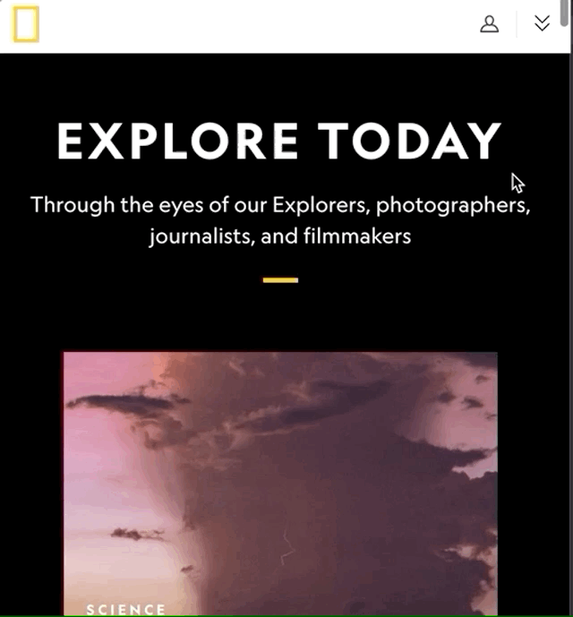

## VEILLE n°2
Il s'agit de reproduire l'effet du Hover sur l'élément.

Le site que j'ai choisi est [National Geographic](https://www.nationalgeographic.com/).

## Ce que je cherche à reproduire:

## Ce que j'ai réussi à faire :

